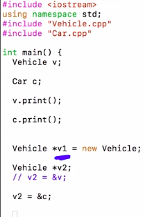

# 1. Compile Time Polymorphism
Created Monday 27 April 2020

Compile Time stuff: Can be decided from the code, if multiple options are available. Does not need processing.

This can be achieved using:

1. Function Overloading: We have multiple functions(with the same name) but different signatures(type, number of arg; different return type is still ambiguous). i.e Compiler decides the function using the signature.
2. Operator Overloading: This is used to change the meaning of operators(w.r.t the object) in order to make code easier.
3. Function overriding: This is simple overriding if we define an inherited function in the base class. Here the inherited function is shadowed, although available explicitly.

An apparently(absurd) thing:
parent_class_pointer = &child_class_object; // vice-versa is not okay

* Base class pointer can point to child class object. **Reverse is not true.**
* We can still only access the parent_class properties only. Even if the child has a function of the same name as the parent class. **Overriding** is absent here because the nearest scope is actually just the pointer type. 

* This is a type of compile time polymorphism as we did not do any processing to identify which function to call. We simply called the function whose pointer was present. virtual keyword before the function was absent here.

